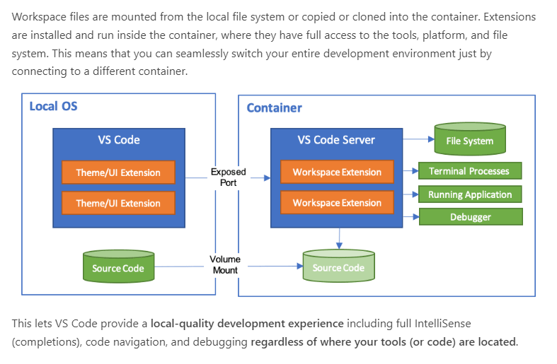
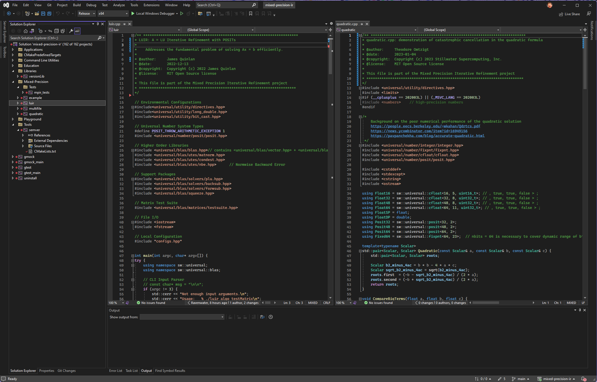

# CMake Universal Template

This repo is a template repo to bootstrap new cmake-based projects that depend on Universal.
It contains gtest and Universal as submodules, and also supports VSCode devcontainers with
a predefined set of compiler environments for gcc9, gcc10, gcc11, gcc12, clang11, clang12, clang13, and clang14.

# How to clone the repo

This repo uses git submodules. The first step after pulling the repository for the first time is to configure the submodules:

```text
> git submodule init && git submodule update
```

When you want to update the submodules you need to request an explicit update:
```test
> git submodule update --init --recursive
```

# How to build

The repo can be build with the standard sequence:

```text
> mkdir build
> cd build
> cmake ..
> make
```

This will build the libraries, the CLI command projects, and the tests in `test/mpir_tests`.

When using VSCode, the repository contains a devcontainer spec in the directory $MPIR_ROOT/.devcontainer. 



The default container provides a build environment based on Clang14:

```json
{
	"image": "stillwater/universal:clang14builder"
}
```
There is a set of builders that can be used that contain specific compilers. Other environments are:
```text
gcc9builder
gcc10builder
gcc12builder
clang11builder
clang12builder
clang13builder
clang14builder
```
If you want to change your development container, simply replace the json with the container of your choice.

You can also build natively. The .gitignore of this repo filters out the following directories:
```text
build/
build_msvc/
build_gcc/
build_clang/
```
You can use these build directories to organize your native and specific build containers so that they can run concurrently. For example, you can use the `build/` directory to hold native builds, and `build_gcc/` directory to hold the default build container builds.

# Install command line tools, libraries, and include files

To install the command line tools for ease of use, issue the `install` target:

```bash
> make install
```

This command will populate the $MPIR_ROOT/bin, $MPIR_ROOT/lib, and $MPIR_ROOT/include directories, where $MPIR_ROOT represents the directory path of the mixed-precision-ir repository clone.

If you are on a Linux or MacOS system, you can add the bin directory to your path to pick up the command line tools:

```bash
> export PATH=$PATH:$MPIR_ROOT/bin
```

For Windows, use the environment variable editor to do the same.

# Project structure

The following figure shows the project structure of this repository:


